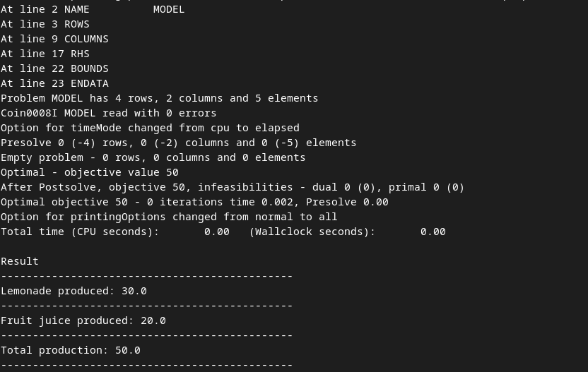
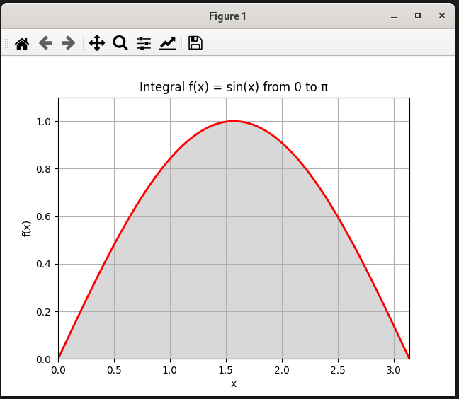

### Завдання 1. Оптимізація виробництва ([task1.py](task1.py))

Компанія виробляє два види напоїв: "Лимонад" і "Фруктовий сік". Для виробництва цих напоїв використовуються різні інгредієнти та обмежена кількість обладнання. Задача полягає у максимізації виробництва, враховуючи обмежені ресурси.

#### Умови завдання:

1. "Лимонад" виготовляється з "Води", "Цукру" та "Лимонного соку".

2. "Фруктовий сік" виготовляється з "Фруктового пюре" та "Води".

3. Обмеження ресурсів: 100 од. "Води", 50 од. "Цукру", 30 од. "Лимонного соку" та 40 од. "Фруктового пюре".

4. Виробництво одиниці "Лимонаду" вимагає 2 од. "Води", 1 од. "Цукру" та 1 од. "Лимонного соку".

5. Виробництво одиниці "Фруктового соку" вимагає 2 од. "Фруктового пюре" та 1 од. "Води".

Використовуючи PuLP, створіть модель, яка визначає, скільки "Лимонаду" та "Фруктового соку" потрібно виробити для максимізації загальної кількості продуктів, дотримуючись обмежень на ресурси. Напишіть програму, код якої максимізує загальну кількість вироблених продуктів "Лимонад" та "Фруктовий сік", враховуючи обмеження на кількість ресурсів.

### Завдання 2. Обчислення визначеного інтеграла ([task2.py](task2.py))

Ваше друге завдання полягає в обчисленні значення інтеграла функції методом Монте-Карло.

функція <b>f(x)=sin(x)</b> 

 - Створюємо діапазон значень для x від 0 до π.
 - Будуємо графік функції sin(x) на цьому інтервалі.
 - Затіняємо область під кривою, яка відповідає площі, обчисленій інтегралом.
 - Додаємо вертикальні лінії, що позначають межі інтеграції (від 0 до π).

Цей код обчислює площу під кривою 
sin(x) методом Монте-Карло та порівнює її з точним значенням, отриманим за допомогою функції quad.

